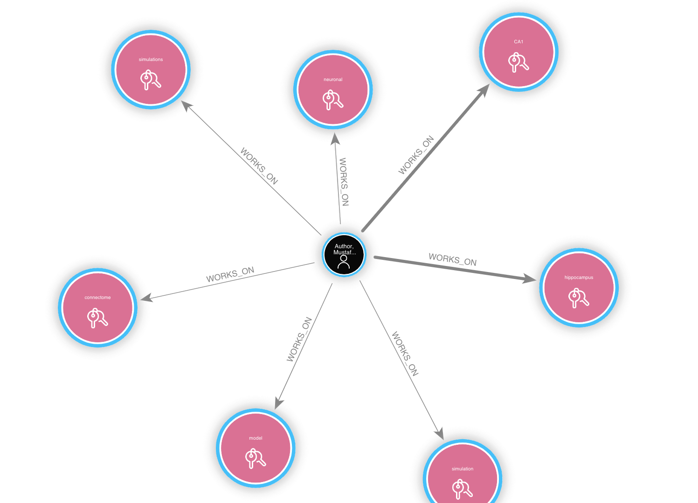
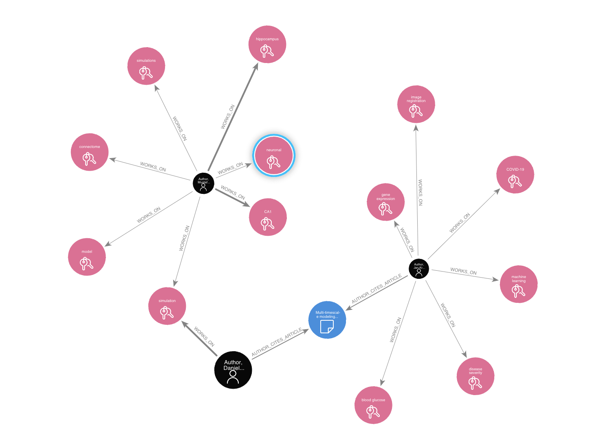
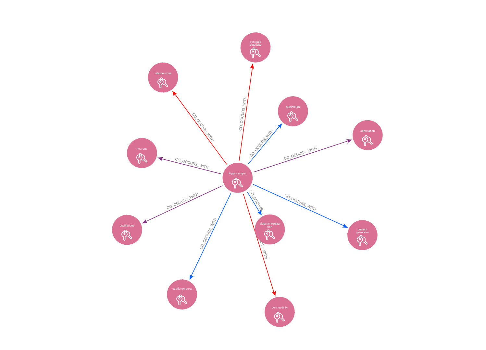
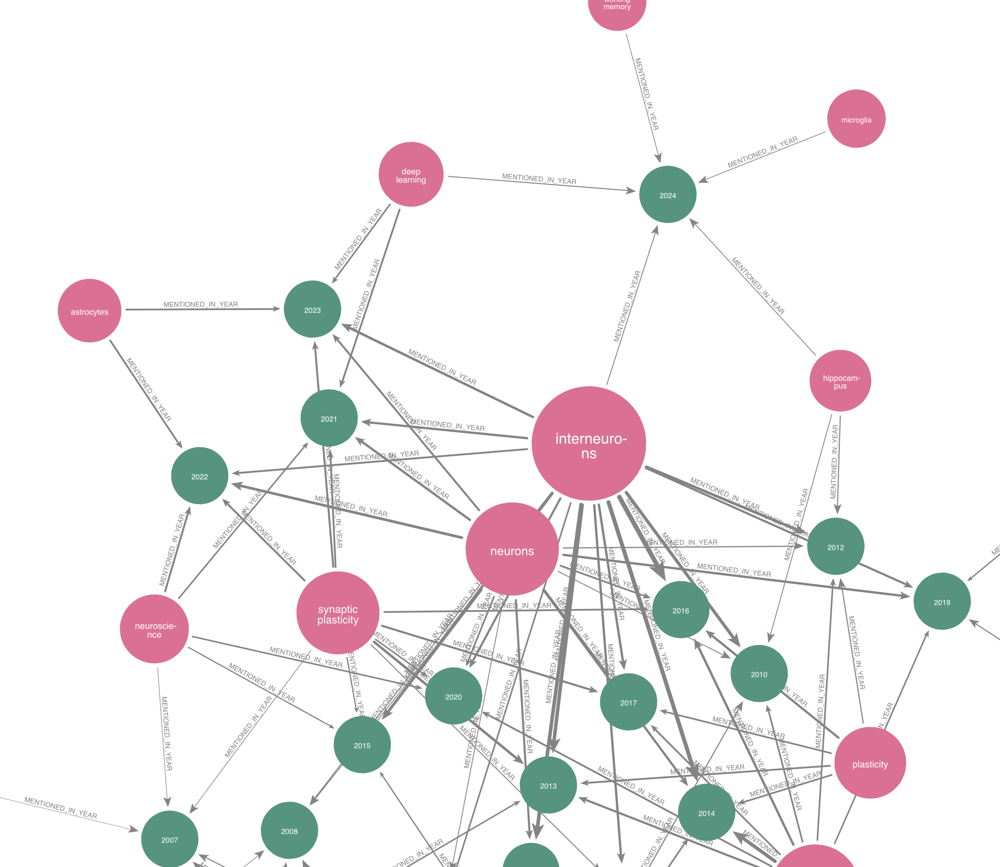
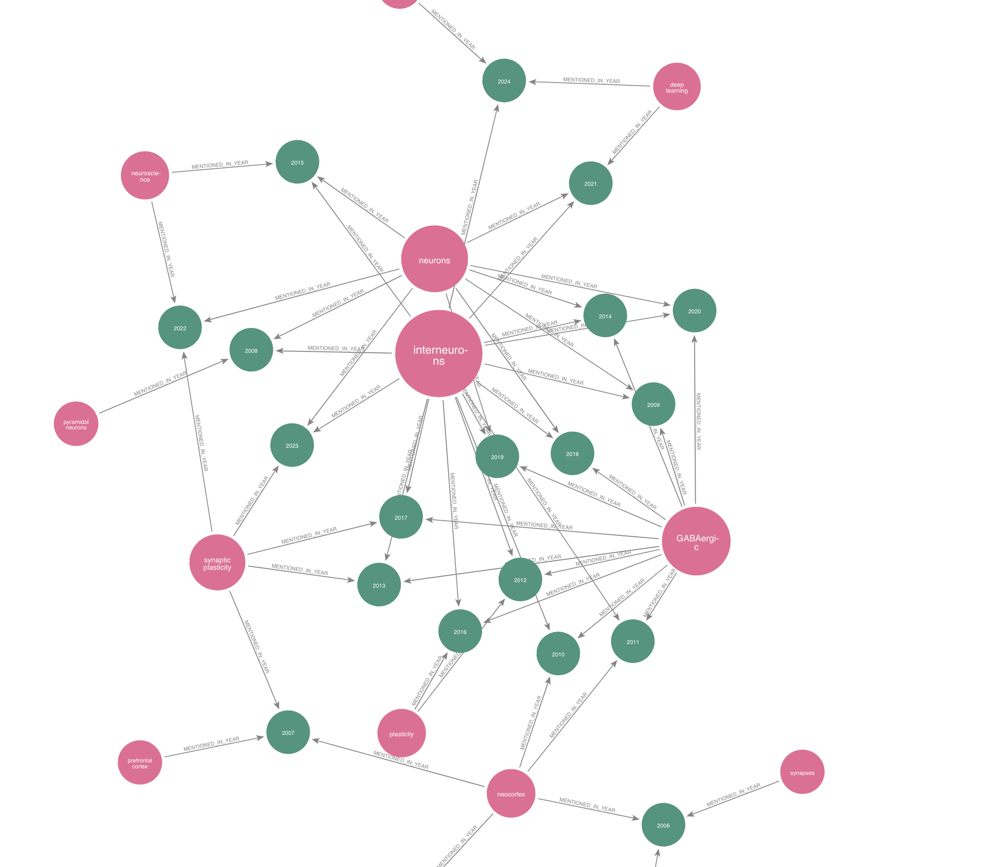

# BlueBrain Citation Graph


## Introduction
This repository provides tools and visualizations for analyzing citations of research articles published by Blue Brain Project and its collaborators across its lifetime. It includes scripts for creating a database of articles and authors, fetching citation data, and performing various analyses such as node embedding, clustering and dimension reduction. The visualizations help in understanding author collaborations, keyword co-occurrences, and thematic trends over time. The repository is designed to integrate seamlessly with Neo4j for advanced graph database functionalities.

## Table of Contents

[Installing the package](#installing-the-package)

[Creating the Database](#creating-the-database)

[Gallery](#gallery)

[Funding and Acknowledgement](#funding-and-acknowledgement)


## Installing the package

```bash
pip install .
```

or

```bash
pip install -e .
```

## Creating the Database 

For detailed instructions on creating the database, please refer to the [step by step tutorial](src/citations/scripts/README.md). We explain a comprehensive guide on gathering articles and authors, fetching citations, embedding articles, clustering, dimension reduction, and integrating data into Neo4j. It also includes additional steps for generating and integrating keywords into the database.

# Gallery 


Below are some visualizations generated from the citation graph data:


*Visualization of author works on specific keywords.*


*A network visualization of author collaborations extracted from the citation data.*


*Co-occurrence of keywords extracted from articles, highlighting thematic groupings.*


*Top 3 keywords per year with node weighting.*


*Top 3 keywords per year with weighting.*


*UMAP clustering using the Louvain method.*

These images provide a glimpse into the complex relationships and structures within the citation graph, offering insights into the research landscape.

## Funding and Acknowledgement

The development of this software was supported by funding to the Blue Brain Project, a research center of the École polytechnique fédérale de Lausanne (EPFL), from the Swiss government’s ETH Board of the Swiss Federal Institutes of Technology.

Copyright (c) 2024 Blue Brain Project/EPFL
