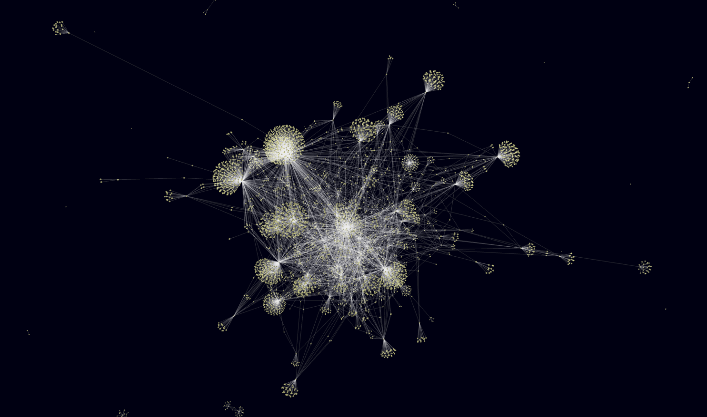

# Citation graph

## Table of Contents



[Installing the package](#installing-the-package)

[Gathering articles with citation data from EuroPMC](#gathering-articles-with-citation-data-from-europmc)

[Gathering author with affiliation data from Orcid](#gathering-author-with-affiliation-data-from-orcid)

[Creating database in Neo4J](#creating-database-in-neo4j)

[Creating main perspectives in Neo4J and Bloom](#creating-main-perspectives-in-neo4j-and-bloom)

[Creating other perspectives in Neo4J and Bloom](#creating-other-perspectives-in-neo4j-and-bloom)

[Funding and Acknowledgement](#funding-and-acknowledgement)


## Installing the package

```bash
pip install .
```

or

```bash
pip install -e .
```

## Gathering articles with citation data from EuroPMC

To run the script `gather_articles.py` located in the `scripts` directory, follow these steps:

1. **Ensure you have the required CSV file** containing BBP publications.
2. **Run the script** using the following command:

```bash
python scripts/gather_articles.py /path/to/bbp_articles.csv
```

## Gathering author with affiliation data from Orcid

To run the script `gather_authors.py` located in the `scripts` directory, follow these steps:

1. **Ensure you have the required CSV file** containing articles gathered by the script "gather_articles.py".
2. **Run the script** using the following command:

```bash
python scripts/gather_authors.py /path/to/articles.csv
```

## Creating database in Neo4J

Run the script 'integrate_batch.py' to create all Nodes and Edges needed.
You can either create the DB in a local Neo4J instance or remotely.

For a local DB run

```bash
python src/citations/scripts/integrate_batch.py data/ bolt://localhost:7687 neo4j neo4j --database neo4j --wipe_db
```

Note: if the authentication does not work, you can try to temporarily disable it.
In Neo4J go to 'Settings...' and set 

```bash
dbms.security.auth_enabled=false
```

However, in order to start Bloom you need to set

```bash
dbms.security.auth_enabled=true
```

## Creating main perspectives in Neo4J and Bloom

These are the perspectives we intend to show for demonstration purposes.

Before making any perspectives, make sure that 

```bash
dbms.security.auth_enabled=true
```

is set for the DB.

In the 'Graph Apps' go to 'Bloom'.
By default an empty perspective will be shown if none are created yet.
On the top left corner click 'Perspective' and in the popup window click on the name of the 
perspective to get to the perspectives Dashboard.
You can use the 'Create' button to create an empty perspective.
For each perspective you should create a saved cypher query that will load the nodes and edges.
For all perspectives, always check the 'Hide unrecognized nodes' option.
When stepping into a Perspective, always 'Clear scene' before loading any nodes and edges.


### Creating 'BBP Author was AFFILIATED_WITH Institution' 

Add the category 'Institution'.
Add the category 'Author'.

Add a 'Saved Cypher':

```bash
MATCH (author:Author)-[aff:AFFILIATED_WITH]->(institution:Institution)
WHERE author.wrote_bbp = true
RETURN author, aff, institution
```

Create a rule for 'Author':

color the nodes RED.

Create a rule for 'Institution':

Color them green by default.
Node size should be proportional to the property 'num_ex_aff_bbp_authors'.

Description:
Show which Authors were at one point affiliated with which Institutions.
We only consider authors who at one point WROTE at least one BBP Article.

Why is it important:
Shows which institutions people who wrote BBP papers were or are affiliated
with and gives insight into which institutions could be customers for BBP.
Institutions who are related to more BBP authors are shown as bigger nodes.
Such institutions might be more relevant as potential customers.


### Creating 'Author CITES BBP Article' 

Add the category 'Article'.
Add the category 'Author'.

Add a 'Saved Cypher':

```bash
MATCH (author:Author)-[cites:CITES]->(article:Article)
WHERE article.is_bbp = true
RETURN author, cites, article
```

Create a rule for 'Author':

If wrote_bbp is true color the nodes RED.
Otherwise color them GRAY.
Node size should be proportional to 'num_bbp_articles_cites'.

Create a rule for 'Article':

If is_bbp property is true, color the node BLUE.
Otherwise color the node YELLOW.

Description:
Show which Authors cited which BBP article.
An Article was cited by an author if an author WROTE
an Article that cited the second Article.

Why is it important:
Shows people who cited BBP articles and so might be potential customers or related
to people or institutions who might be customers.


### Creating 'Institution CITES BBP Article' 

Add the category 'Article'.
Add the category 'Institution'.

Add a 'Saved Cypher':

```bash
MATCH (i:Institution)-[cites:CITES]->(article:Article)
WHERE article.is_bbp = true
RETURN i, cites, article
```

Create a rule for 'Institution':

Color them green.
Size should be proportional to the property 'num_bbp_articles_cited'

Create a rule for 'Article':

If is_bbp property is true, color the node blue.
Otherwise color the node yellow.

Description:
Show which Institutions CITES which Article.
An Institution is said to CITES an Article
if an Author was associated with them who CITES a BBP Article,
and the Authors affiliation happened at the same time as
the Articles publication.

Why is it important:
Shows which institutions 'cited' a BBP article.

### Creating Author WROTE BBP Article

Add the category 'Author'.

Cypher query:

```bash
MATCH (author:Author)-[wrote:WROTE]->(article:Article)
WHERE article.is_bbp = true
RETURN author, wrote, article
```

Create a rule for 'Article':

Color should be BLUE.

Create a rule for 'Author':

Node color should be RED.
Node size should be proportional to the property 'num_bbp_articles_written'.

Description:
Show only BBP Authors.

Why is it important:
People who wrote BBP Articles at one point might be interested in BBP later.


## Creating other perspectives in Neo4J and Bloom

### Creating 'Articles' 

In Bloom create a new perspective and call it 'Articles'.
Add the category 'Article'.
Add a 'Saved Cypher':

Search phrase:

```bash
Articles
```

Cypher query:

```bash
MATCH (article:Article)
RETURN article
```

In the Search field search with the new query.
Create a rule for 'Article':

If is_bbp property is true, color the node blue.
If is_bbp property is false, color the node yellow.

Description:
Show all Articles.

### Creating 'Authors' 

In Bloom create a new perspective and call it 'Authors'.
Add the category 'Author'.
Add a 'Saved Cypher':

Cypher query:

```bash
MATCH (author:Author)
RETURN author
```

Create a rule for 'Author':

If wrote_bbp is true, the Author node should be RED.
Otherwise it should be GRAY.
Node size should be proportional to the property 'articles_written'.

Description:
Show all Authors.

### Creating 'BBP Authors' 

Add the category 'Author'.

Cypher query:

```bash
MATCH (author:Author)
WHERE author.wrote_bbp = true
RETURN author
```

Create a rule for 'Author':

Node color should be RED.
Node size should be proportional to the property 'bbp_articles_written'.

Description:
Show only BBP Authors.

### Creating 'Institutions' 

Add the category 'Institution'.
Add a 'Saved Cypher':

```bash
MATCH (institution:Institution)
RETURN institution
```

Create a rule for 'Institution':

Color the nodes green.
Node size should be proportional to the property 'num_bbp_articles_cites'.

Description:
Show all Institutions.

### Creating 'Article Cites Article' 

Add the category 'Article Cites Article'.
Add a 'Saved Cypher':

```bash
MATCH (a:Author)-[r:CITES]->(b:Article)
RETURN a, r, b
```

Create a rule for 'Article':

If is_bbp property is false, color the node yellow.
If is_bbp property is true, color the node blue.
Node size should be proportional to the property 'num_articles_cite'.

Description:
Show all Cites connections between Articles.

### Creating 'Author WROTE Article' 

Add the category 'Article'.
Add the category 'Author'.

Add a 'Saved Cypher':

```bash
MATCH (author:Author)-[wrote:WROTE]->(article:Article)
RETURN author, wrote, article
```

Create a rule for 'Author':

If wrote_bbp is true color the nodes RED.
Otherwise color them GRAY.
Node size should be proportional to the property 'num_articles_written'.

Create a rule for 'Article':

If is_bbp property is true, color the node BLUE.
Otherwise color the node YELLOW.

Description:
Show which Authors wrote which Articles.

### Creating 'Author WROTE BBP Article' 

Add the category 'Article'.
Add the category 'Author'.

Add a 'Saved Cypher':

```bash
MATCH (author:Author)-[wrote:WROTE]->(article:Article)
WHERE article.is_bbp = true
RETURN author, wrote, article
```

Create a rule for 'Author':

If wrote_bbp is true color the nodes red.
Otherwise color them purple.
Node size should be proportional to the property 'num_bbp_articles_written'.

Create a rule for 'Article':

If is_bbp property is true, color the node blue.
Otherwise color the node yellow.

Description:
Show which Authors wrote which BBP Articles.

### Creating 'Author was AFFILIATED_WITH Institution' 

Add the category 'Institution'.
Add the category 'Author'.

Add a 'Saved Cypher':

```bash
MATCH (author:Author)-[aff:AFFILIATED_WITH]->(institution:Institution)
RETURN author, aff, institution
```

Create a rule for 'Author':

Color nodes GRAY, unless wrote_bbp is true then color the nodes RED.


Create a rule for 'Institution':

Color them GREEN.
Node size should be proportional to the property 'num_ex_aff_authors'.

Description:
Show which Authors were at one point affiliated with which Institutions.

### Creating 'Author currently AFFILIATED_WITH with Institution' 

Add the category 'Institution'.
Add the category 'Author'.

Add a 'Saved Cypher':

```bash
MATCH (author:Author)-[aff:AFFILIATED_WITH]->(institution:Institution)
WHERE aff.current = true
RETURN author, aff, institution
```

Create a rule for 'Author':

If wrote_bbp is true color the nodes red.
Otherwise color them gray.

Create a rule for 'Institution':

Color them green.
Node size should be proportional to the property 'num_currently_aff_authors'.

Description:
Show which Authors are currently affiliated with which Institutions.
This means that we only consider the 'newest' Institution of each Author.


### Creating 'BBP Author currently AFFILIATED_WITH Institution' 

Add the category 'Institution'.
Add the category 'Author'.

Add a 'Saved Cypher':

```bash
MATCH (author:Author)-[aff:AFFILIATED_WITH]->(institution:Institution)
WHERE aff.current = true AND author.wrote_bbp = true
RETURN author, aff, institution
```

Create a rule for 'Author':

If wrote_bbp is true color the nodes red.
Otherwise color them purple.

Create a rule for 'Institution':

Color them green.
Node size should be proportional to the property 'num_currently_aff_bbp_authors'.

Description:
Show which BBP Authors are currently affiliated with which Institutions.
This means that we only consider the 'newest' Institution of each Author.

Why is it important:
Shows people who cited BBP articles and so might be potential customers.


## Funding and Acknowledgement

The development of this software was supported by funding to the Blue Brain Project, a research center of the École polytechnique fédérale de Lausanne (EPFL), from the Swiss government’s ETH Board of the Swiss Federal Institutes of Technology.

Copyright (c) 2024 Blue Brain Project/EPFL
