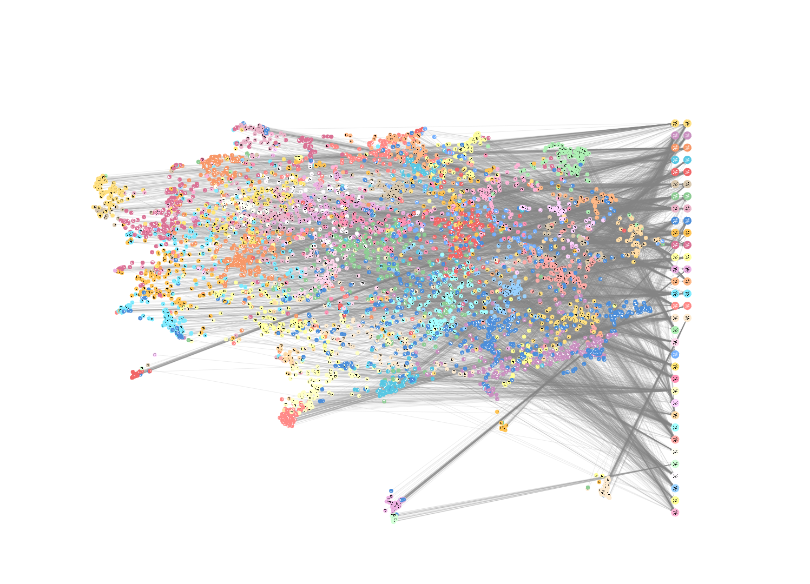

# Blue Brain Citation Graph


## Table of Contents

[Introduction](#introduction)

[Generating or Loading the Database](#generating-or-loading-the-database)

[Gallery](#gallery)

[Funding and Acknowledgement](#funding-and-acknowledgement)

## Introduction

The Blue Brain Citation Graph leverages advanced Neo4j technologies to enhance the exploration and analysis of citation data. Key features include:

- **Perspectives**: These are specialized views that focus on different aspects of the knowledge graph. In this repository, you will find several perspectives under `src/citations/perspectives/`:
  - **BBP or Not Perspective**: This perspective helps in distinguishing between articles published by the Blue Brain Project and those by other collaborators.
  - **Timeview Perspective**: This perspective provides a temporal view of the citation data, allowing users to analyze trends and changes over time.
  - **Topics Perspective**: This perspective focuses on thematic clustering, enabling users to explore articles based on their subject matter.

- **Search Phrases**: These are predefined queries that facilitate quick access to specific data points within the graph. They are designed to help users efficiently navigate the vast amount of information stored in the database.

- **Scene Actions**: These are interactive elements that allow users to manipulate and explore the graph dynamically. Scene actions can include filtering nodes, highlighting specific paths, or triggering animations to better visualize relationships and patterns within the data.

By utilizing these Neo4j technologies, the Blue Brain Citation Graph provides a robust framework for researchers and analysts to gain deeper insights into the citation landscape of the Blue Brain Project and its collaborators.


## Generating or Loading the Database

When working with the Blue Brain Citation Graph, you have two primary options: generating the database from scratch or loading an existing database.

### Generating the Database

To generate the database, you will need to follow a series of steps that involve gathering articles, authors, and citation data, embedding articles, clustering, and performing dimension reduction. This process requires access to external APIs, specifically the SERP API and the OpenAI API. Please be aware that using these APIs may incur costs, as they are not free services. The generation process is comprehensive and allows for a customized and up-to-date database tailored to your specific needs.

For detailed instructions on creating the database, please refer to the [step by step tutorial](src/citations/scripts/README.md). But first install the necessary packages in a fresh virtual environment with:

```bash
pip install .
```

or

```bash
pip install -e .
```


 We explain a comprehensive guide on gathering articles and authors, fetching citations, embedding articles, clustering, dimension reduction, and integrating data into Neo4j. It also includes additional steps for generating and integrating keywords into the database.


### Loading the Database

Alternatively, if you have an existing database dump, you can load it directly into your Neo4j instance. This is a quicker option and does not require the use of external APIs. You can use the `neo4j-admin` tool to load the database dump file, as described in the "Loading the Database" section. This method is cost-effective and efficient if you already have a pre-generated database that suits your requirements.


Run the following command in the terminal or command prompt:

```bash
neo4j-admin load --from=/path/to/backup/backup.dump --database=neo4j --force
```

- Replace /path/to/backup/backup.dump with the actual path to your dump file.
- The --database=neo4j option specifies the name of the database you want to load into. Make sure you are using the correct database name.
- The --force option is used to overwrite the existing database.

After the loading process is complete, you can start your Neo4j database:

```bash
neo4j start
```

# Gallery 


Below are some visualizations generated from the citation graph data:


*Visualization of author works on specific keywords.*


*A network visualization of author collaborations extracted from the citation data.*


*Co-occurrence of keywords extracted from articles, highlighting thematic groupings.*


*Top 3 keywords per year with node weighting.*


*Top 3 keywords per year with weighting.*


*UMAP clustering using the Louvain method.*

These images provide a glimpse into the complex relationships and structures within the citation graph, offering insights into the research landscape.

## Funding and Acknowledgement

The development of this software was supported by funding to the Blue Brain Project, a research center of the École polytechnique fédérale de Lausanne (EPFL), from the Swiss government’s ETH Board of the Swiss Federal Institutes of Technology.

Copyright (c) 2024 Blue Brain Project/EPFL
